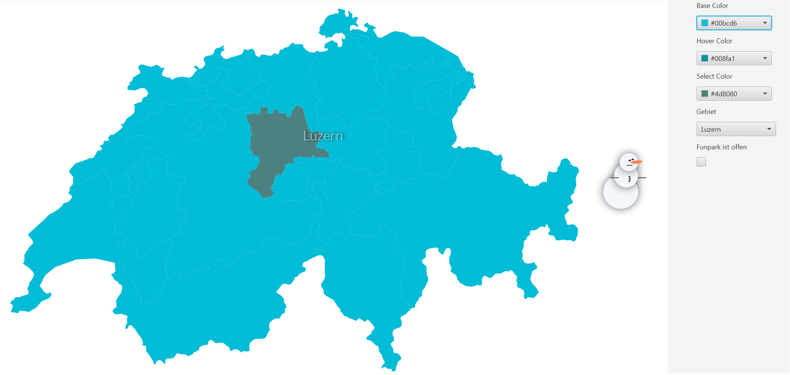

# swiss-canton-selector
**A custom control to select cantons on a map**

## What is the Swiss Canton Selector
A custom control where you can select a canton or a set of cantons from a map and bind the selection to whatever you want

## Main Features
* Use cantons or regions (set of cantons)

* Hover text while selecting a canton or a region

* Bind the selection to other controls

* Bidirectional bind from other controls

* Free to use different base, hover and select colors